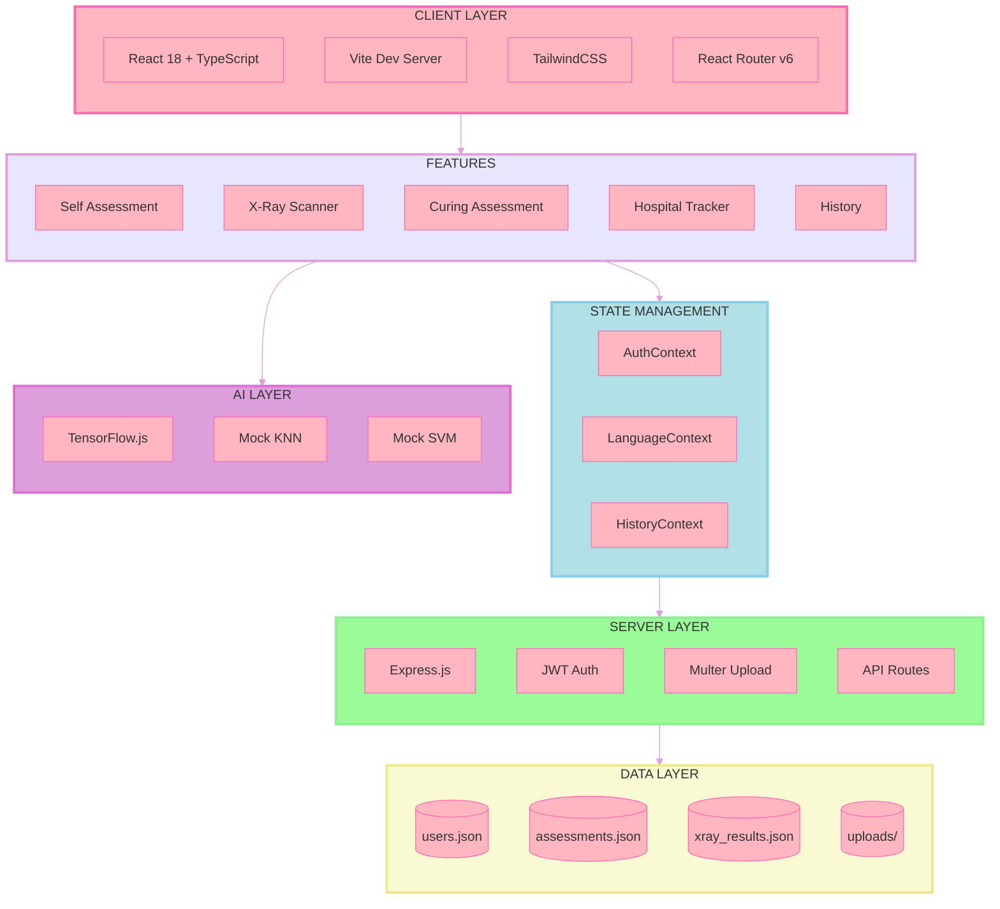
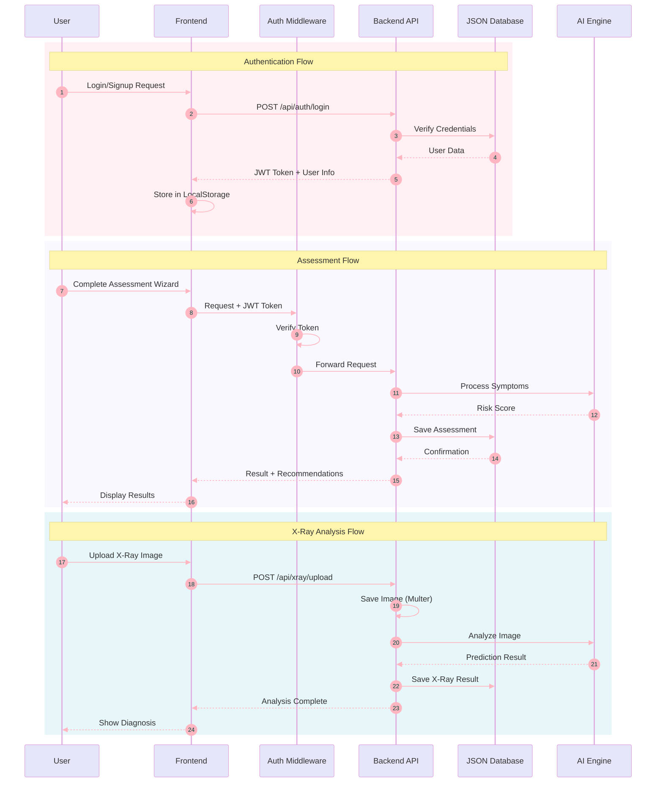
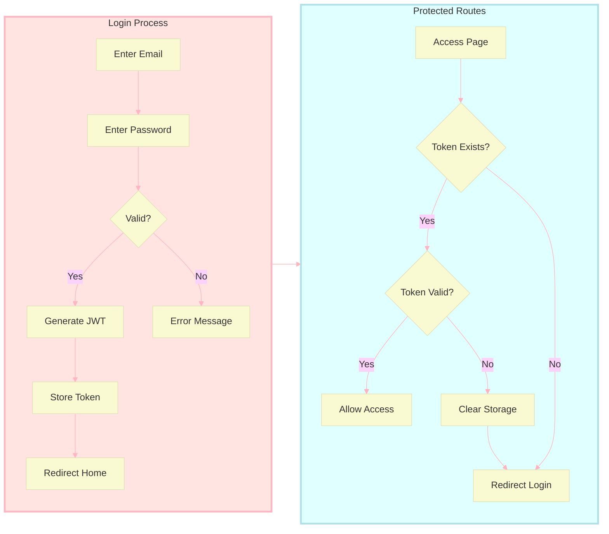
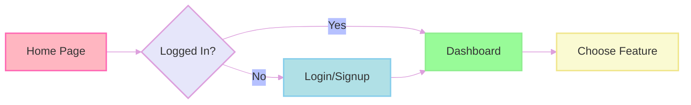

<div align="center">

#  DeepNeumoScan

### AI-Powered Pneumonia Detection & Health Assessment Platform


[](https://reactjs.org/)
[](https://www.typescriptlang.org/)
[](https://nodejs.org/)
[](https://tailwindcss.com/)
[](https://vitejs.dev/)

<p align="center">
    <strong>Multilingual Support: English | Kannada</strong>
</p>

<p align="center">
    
    
    
</p>

---

### Team Members

| Role | Name | 
|------|------|
| Team Member | SHIFA |
| Team Member | SINCHANA |
| Team Member | RASHIKA.N |

### Contributor

<a href="https://github.com/Tanishq-JM">
    
</a>

---

</div>

## Table of Contents

- [Overview](#overview)
- [Architecture](#architecture)
- [Features](#features)
- [Quick Start](#quick-start)
- [Usage Guide](#usage-guide)
- [API Documentation](#api-documentation)
- [Project Structure](#project-structure)
- [Tech Stack](#tech-stack)
- [Data Storage](#data-storage)
- [Contributing](#contributing)

---

## Overview

**DeepNeumoScan** is a comprehensive healthcare web application designed to assist users in early pneumonia detection through AI-powered X-ray analysis and symptom-based self-assessments. The platform provides a user-friendly wizard interface for assessments, tracks medical history, and helps locate nearby hospitals.

### Key Highlights

| Feature | Description |
|---------|-------------|
| AI Analysis | Machine learning-based chest X-ray analysis |
| Smart Assessments | Step-by-step wizard for symptom evaluation |
| Risk Scoring | Automated Low/Moderate/High risk classification |
| Hospital Finder | Locate nearby healthcare facilities |
| History Tracking | Complete medical assessment history |
| Bilingual | English & Kannada language support |

---

## Architecture

### System Architecture Diagram



### Data Flow Diagram



### Authentication Flow



---

## Features

### Self-Assessment Wizard
> **Step-by-step symptom evaluation with intelligent risk scoring**

- **10+ Comprehensive Questions** covering all pneumonia symptoms
- **Automatic Risk Calculation**: Low / Moderate / High
- **Personalized Recommendations** based on results
- **One Question at a Time** - Easy wizard interface

### X-Ray Scan Analysis
> **AI-powered chest X-ray analysis for pneumonia detection**

- **Easy Image Upload** - Drag & drop or click to upload
- **ML-Based Analysis** using TensorFlow.js
- **Confidence Scoring** with probability percentages
- **Fallback System** - Mock KNN/SVM when TensorFlow unavailable

### Curing Assessment
> **Track your recovery progress over time**

- **Recovery Questionnaire** with medical questions
- **Progress Tracking** - Monitor improvement
- **Historical Comparison** with previous assessments

### Hospital Tracker
> **Find nearby healthcare facilities**

- **Location-Based Search** using geolocation
- **Hospital Details** including contact info
- **Distance Calculation** from your location

### History Dashboard
> **Complete medical record management**

- **All Assessments** - Self, Curing, X-Ray results
- **Date Organized** - Easy navigation
- **Delete Records** - Manage your data
- **Responsive Cards** - Beautiful UI

### Language Support
> **Full bilingual interface**

| Language | Code | Status |
|----------|------|--------|
| English | `en` | Complete |
| Kannada | `kn` | Complete |

---

## Quick Start

### Prerequisites

| Requirement | Version | Download |
|-------------|---------|----------|
| Node.js | ≥ 18.x | [nodejs.org](https://nodejs.org/) |
| npm | ≥ 9.x | Included with Node.js |
| Git | Latest | [git-scm.com](https://git-scm.com/) |

### Installation

#### Windows (PowerShell)

```powershell
# Clone the repository
git clone https://github.com/yourusername/deepneumoscan.git
cd deepneumoscan

# Install & Start Backend
cd backend
npm install
npm run dev

# Open new terminal for Frontend
cd frontend
npm install
npm run dev
```

#### macOS / Linux (Bash)

```bash
# Clone the repository
git clone https://github.com/yourusername/deepneumoscan.git
cd deepneumoscan

# Install & Start Backend
cd backend && npm install && npm run dev

# Open new terminal for Frontend
cd frontend && npm install && npm run dev
```

### Access Points

| Service | URL | Description |
|---------|-----|-------------|
| Frontend | `http://localhost:5173` | React Application |
| Backend | `http://localhost:5000` | Express API Server |
| API Base | `http://localhost:5000/api` | REST Endpoints |

### Test Account

```
Email:    test@example.com
Password: password123
```

> **Tip**: You can also create a new account via the Signup page!

---

## Usage Guide

### 1. Getting Started



### 2. Self-Assessment Flow

1. **Navigate** to Self-Assessment page
2. **Answer** each question one at a time
3. **Click Next** to proceed through the wizard
4. **Submit** when all questions are answered
5. **View Results** with risk level and recommendations

### 3. X-Ray Analysis Flow

1. **Navigate** to X-Ray Scan page
2. **Upload** a chest X-ray image (JPEG/PNG)
3. **Wait** for AI analysis
4. **Review** the prediction results
5. **Save** to your history

### 4. View History

1. **Navigate** to History page
2. **Browse** past assessments and X-ray results
3. **Click** on any record for details
4. **Delete** records you no longer need (delete button)

---

## API Documentation

### Authentication Endpoints

| Method | Endpoint | Description | Body |
|--------|----------|-------------|------|
| `POST` | `/api/auth/signup` | Register new user | `{name, email, password}` |
| `POST` | `/api/auth/login` | Login user | `{email, password}` |

### Assessment Endpoints

| Method | Endpoint | Description | Auth |
|--------|----------|-------------|------|
| `GET` | `/api/assessments` | Get all assessments | Required |
| `POST` | `/api/assessments` | Create assessment | Required |
| `DELETE` | `/api/assessments/:id` | Delete assessment | Required |

### X-Ray Endpoints

| Method | Endpoint | Description | Auth |
|--------|----------|-------------|------|
| `GET` | `/api/xray` | Get all X-ray results | Required |
| `POST` | `/api/xray/upload` | Upload & analyze X-ray | Required |
| `DELETE` | `/api/xray/:id` | Delete X-ray result | Required |

### Hospital Endpoints

| Method | Endpoint | Description | Auth |
|--------|----------|-------------|------|
| `GET` | `/api/hospitals` | Get nearby hospitals | Required |

### History Endpoints

| Method | Endpoint | Description | Auth |
|--------|----------|-------------|------|
| `GET` | `/api/history` | Get complete history | Required |

### Request Headers

```http
Authorization: Bearer <your_jwt_token>
Content-Type: application/json
```

### Example Request

```javascript
// Self-Assessment Submission
const response = await fetch('http://localhost:5000/api/assessments', {
    method: 'POST',
    headers: {
        'Authorization': `Bearer ${token}`,
        'Content-Type': 'application/json'
    },
    body: JSON.stringify({
        type: 'self',
        answers: {
            fever: 'yes',
            cough: 'severe',
            breathing: 'difficult',
            // ... more answers
        }
    })
});
```

---

## Project Structure

```
DeepNeumoScan/
├── backend/
│   ├── server.ts              # Express server entry
│   ├── package.json           # Backend dependencies
│   ├── tsconfig.json          # TypeScript config
│   ├── config/
│   │   └── db.ts              # Database configuration
│   ├── middleware/
│   │   └── auth.ts            # JWT authentication
│   ├── models/
│   │   ├── Assessment.ts      # Assessment model
│   │   ├── History.ts         # History model
│   │   ├── User.ts            # User model
│   │   └── XrayResult.ts      # X-Ray result model
│   ├── routes/
│   │   ├── assessments.ts     # Assessment API
│   │   ├── auth.ts            # Auth API
│   │   ├── history.ts         # History API
│   │   ├── hospitals.ts       # Hospital API
│   │   └── xray.ts            # X-Ray API
│   └── data/                  # JSON database files
│       ├── users.json
│       ├── assessments.json
│       └── xray_results.json
│
├── frontend/
│   ├── index.html             # HTML entry point
│   ├── package.json           # Frontend dependencies
│   ├── vite.config.ts         # Vite configuration
│   ├── tailwind.config.js     # Tailwind configuration
│   ├── tsconfig.json          # TypeScript config
│   └── src/
│       ├── App.tsx            # Main React component
│       ├── main.tsx           # React entry point
│       ├── index.css          # Global styles
│       ├── components/
│       │   ├── Layout.tsx
│       │   ├── LanguageToggle.tsx
│       │   └── ProtectedRoute.tsx
│       ├── context/
│       │   ├── AuthContext.tsx
│       │   ├── HistoryContext.tsx
│       │   └── LanguageContext.tsx
│       ├── hooks/
│       │   ├── useAuth.ts
│       │   └── useLanguage.ts
│       ├── i18n/
│       │   ├── en.json        # English translations
│       │   └── kn.json        # Kannada translations
│       ├── pages/
│       │   ├── Home.tsx
│       │   ├── Login.tsx
│       │   ├── Signup.tsx
│       │   ├── SelfAssessment.tsx
│       │   ├── CuringAssessment.tsx
│       │   ├── XRayScan.tsx
│       │   ├── History.tsx
│       │   └── HospitalTracker.tsx
│       ├── services/
│       │   ├── api.ts         # API service layer
│       │   └── ai.ts          # AI prediction service
│       └── types/
│           └── index.ts       # TypeScript types
│
└── README.md                  # This file
```

---

## Tech Stack

### Frontend

| Technology | Purpose | Version |
|------------|---------|---------|
| React | UI Library | 18.3.1 |
| TypeScript | Type Safety | 5.5.3 |
| Vite | Build Tool | 5.3.1 |
| TailwindCSS | Styling | 3.4.18 |
| React Router | Navigation | 6.x |
| Lucide React | Icons | Latest |
| TensorFlow.js | ML in Browser | Latest |

### Backend

| Technology | Purpose | Version |
|------------|---------|---------|
| Node.js | Runtime | ≥18.x |
| Express.js | Web Framework | 4.21.2 |
| TypeScript | Type Safety | Latest |
| JWT | Authentication | 9.0.2 |
| Multer | File Upload | Latest |
| ts-node-dev | Dev Server | Latest |

### Data Layer

| Technology | Purpose |
|------------|---------|
| JSON Files | Database Storage |
| File System | Image Storage |

---

## Data Storage

### Database Files Location

```
backend/data/
├── users.json         # User accounts & credentials
├── assessments.json   # Self & Curing assessments
└── xray_results.json  # X-Ray analysis results
```

### Image Storage

```
backend/uploads/
└── *.jpg/*.png        # Uploaded X-Ray images
```

### Reset Data

To reset all application data:

```powershell
# Navigate to backend data folder
cd backend/data

# Delete all JSON files
Remove-Item *.json

# Restart backend - files will auto-regenerate
```

---

## Contributing

We welcome contributions! Here's how you can help:

1. **Fork** the repository
2. **Create** a feature branch (`git checkout -b feature/amazing-feature`)
3. **Commit** your changes (`git commit -m 'Add amazing feature'`)
4. **Push** to the branch (`git push origin feature/amazing-feature`)
5. **Open** a Pull Request

---

<div align="center">

---

### Made with Love in India


**Empowering early pneumonia detection through AI**

---

### Our Amazing Team

<table align="center">
    <tr>
        <td align="center"><b>SHIFA</b><br/><sub>Team Member</sub></td>
        <td align="center"><b>SINCHANA</b><br/><sub>Team Member</sub></td>
        <td align="center"><b>RASHIKA.N</b><br/><sub>Team Member</sub></td>
    </tr>
</table>

### Contributor

<a href="https://github.com/Tanishq-JM">
    
</a>

---

Star this repo if you find it helpful!

[](https://github.com/Tanishq-JM)
[]()

**License**: MIT

</div>
